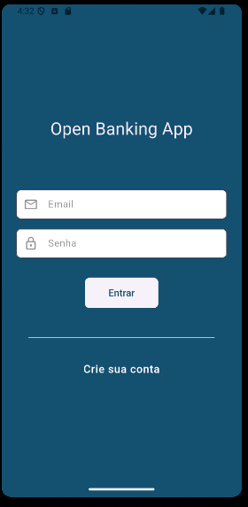
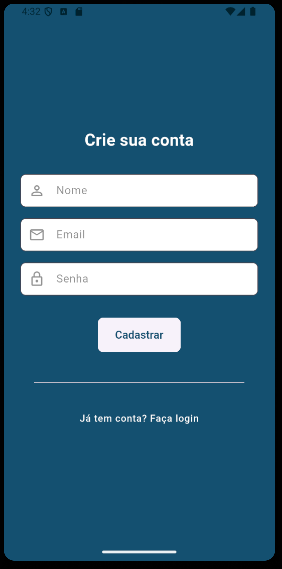
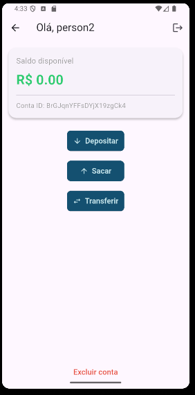

# Open Banking App — Frontend

Aplicativo desenvolvido em Flutter (3.8) utilizando Riverpod 3+ para gerenciamento de estado e o padrão Repository, com foco em modularidade, escalabilidade e boas práticas de arquitetura.
Compatível com Android 15 (API 35).

#### Tecnologias Utilizadas

- Flutter 3.8
  - SDK multiplataforma moderna
- Riverpod 3+
  - Gerenciamento de estado reativo e seguro
- HttpClient
  - Comunicação com a API Node.js (backend)

### Arquitetura do Projeto

A arquitetura foi construída em camadas para separar responsabilidades e facilitar manutenção e testes.
```
Frontend/
      lib/
      ├── core/           → Configurações de cliente HTTP e constantes globais
      ├── models/         → Modelos de dados (User, Account, Transaction, etc.)
      ├── providers/      → Providers que gerenciam estado e chamam os repositórios
      ├── repositories/   → Fontes de dados (requisições para o backend)
      ├── utils/          → Funções e estilos utilitários
      ├── views/          → Telas principais do app (Login, Cadastro, Home)
      ├── app.dart        → Configuração principal do aplicativo
      └── main.dart       → Ponto de entrada da aplicação
      pubspec.yaml
      README.md
```

### Telas do Aplicativo

Login → Autenticação do usuário

Cadastro → Criação de novo usuário e conta

Home → Exibição de saldo e operações (depósito, saque, transferência)

<div align="center">

  <figure style="display:inline-block; text-align:center; margin:10px;">
    
  </figure>

  <figure style="display:inline-block; text-align:center; margin:10px;">
    
  </figure>

  <figure style="display:inline-block; text-align:center; margin:10px;">
    
  </figure>

</div>


### Gerenciamento de Estado

O projeto utiliza o Riverpod 3+ com a estrutura de:

``Notifier`` e ``AsyncNotifier`` para controle reativo

Providers para comunicação entre repositories e views

Injeção de dependência simplificada via ``ProviderScope``

### Comunicação com a API

Todas as requisições HTTP são centralizadas no ``core/api_client.dart``, e distribuídas por meio dos repositórios:

- UserRepository
- AccountRepository
- TransactionRepository

Os providers interagem com esses repositórios e expõem dados para as telas.

#### Fluxo Geral

Crie o arquivo ``.env`` com a variável ``API_URL`` e coloque a url para direcionar o backend:

(Para rodar o código Flutter no emulador android não usamos _localhost_ mas _10.0.2.2_),
exemplo:
```
API_URL=http://10.0.2.2:3030/api
```

Usuário faz ``login`` → provider autentica e armazena token;

``Account`` é criada automaticamente (no cadastro);

``HomePage`` exibe informações da conta e saldo;

Transações atualizam o estado global em tempo real via providers;

## **Autor**

Desenvolvido por **Jonathan Samael** - 2025

> Projeto — Open Banking App
